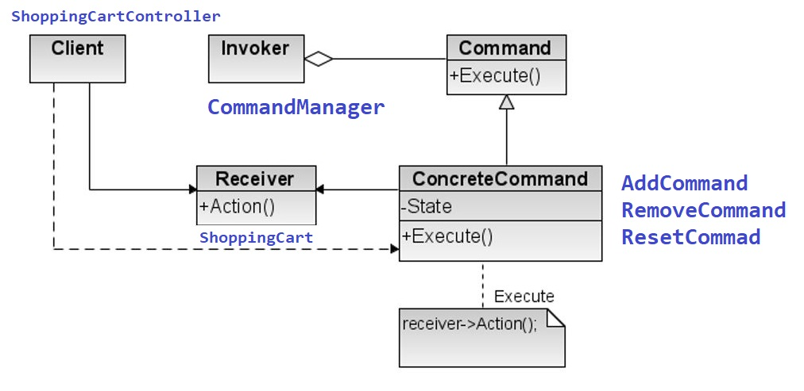

# Pattern Command applied to Shopping Cart Example

See about Commmand Pattern in : https://refactoring.guru/design-patterns/command


- **Goal of App**:
    * Manager a ShoppingCart providing 3 commands:
        * adding a Product
        * removing Product 
        * reset the list build
    * The execution of each of this three commands can be undo 
    
    
- We have two classes that provide Main function
    - MainConsola (to test, the features, add, remove, reset and undo)
    - MainGui que é a app com GUI construida em JavaFX
 
 In this application the classes has the following roles on the pattern command
  
  
  
  
  - The Invoker is responsible for initiating requests. This class must have a field for storing a reference to a command object. The sender triggers that command instead of sending the request directly to the receiver. Note that the sender isn’t responsible for creating the command object.
    ```java
    public class CommandManager {
        private Stack<Command> commands;
 
    public CommandManager() {
            commands = new Stack();
        }
    
        public void executeCommand(Command command){
            command.execute();
            commands.push(command);
        }
    ```
 
  - The Command interface usually declares just a single method for executing the command. In this case define the unExecute method too. 
  ```java
    public interface Command {
        void execute();
        void unExecute();
    }
  ```
  
  - Concrete Commands implement various kinds of requests. A concrete command isn’t supposed to perform the work on its own, but rather to pass the call to the receiver object.Parameters required to execute a method on a receiving object can be declared as fields in the concrete command. You can make command objects immutable by only allowing the initialization of these fields via the constructor.
    
    ```java
    public class RemoveCommand implements Command{
        private ShoppingCart cart;
        private String name;
        private Product removeProduct;
    
        public RemoveCommand(ShoppingCart cart, String name) {
            this.cart = cart;
            this.name = name;
        }
    
        @Override
        public void execute() {
            System.out.println("EXECUTE REMOVE");
            removeProduct = cart.removeProduct(name);
            return;
    
        }
    
        @Override
        public void unExecute() {
            cart.addProduct(removeProduct);
        }
    }
    ```
  - The Receiver class contains some business logic. Almost any object may act as a receiver. Most commands only handle the details of how a request is passed to the receiver, while the receiver itself does the actual work.
  ```java
    //In ShoppingCart class
     public void removeProduct(Product p) {
            products.remove(p);
        }
  ```
  - The Client creates and configures concrete command objects. The client must pass all of the request parameters, including a receiver instance, into the command’s constructor. After that, the resulting command may be associated with one or multiple invoker.
  ```java
    //In ShoppingCartController class
    public void removeProduct(String name) {
        Command c = new RemoveCommand(cart,name); 
        commandmanager.executeCommand(c);
    }
  ``` 
  Note: The undo features is implemented using the unExecute of a command: The Client Class ask to the Invoker to unExecute the last command saved.
  ```java
//In ShoppingCartController
  public void undo() {
        commandmanager.undo();        
    }
  ``` 
    
  ```java
    //In CommandManager
     public void undo(){
            if (commands.empty())
                throw new ShoppingCartException("No Undo");
            Command cmd = commands.pop();
            cmd.unExecute();
        }
    ```
  